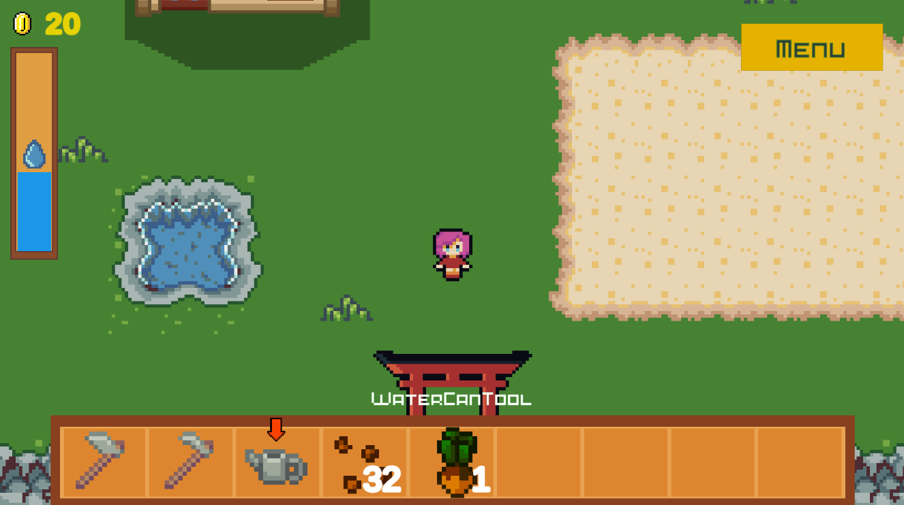
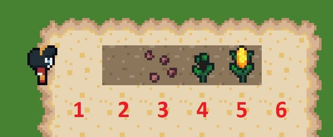
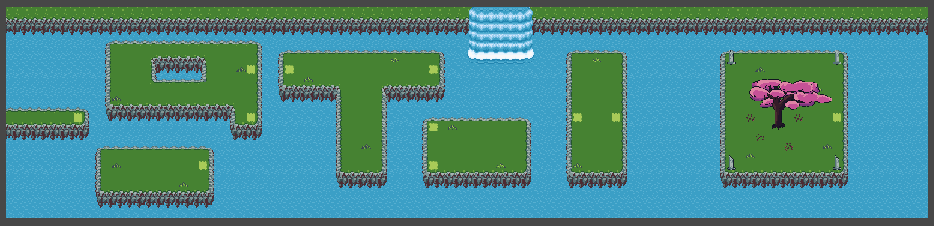

+++
title = 'Spring Light'
date = 2024-06-30T17:14:42-03:00
+++



As part of my Software Engineering degree, I was required to complete a final theses. I centered mine around the concept of Game Development, investigating and presenting a 200 page paper on the subject. Complementary to this, I put the researched knowledge into practice by actually developing my own simple videogame in the Unity Engine.

This game features different mechanics inspired in other similar RPGs, farm-simulator games and other puzzle games. The pixel art presented in the game is either from open source, royalty-free sources or created by myself in Aseprite.

The project took about six months to be completed, between Art, Coding and Game Design. This was my first videogame ever created so I had to learn how to do things fron scratch and iterate over them as I discovered new and better solutions. I also borrowed the help of friends and family to carry out playtests and refine features.

You can find both the original paper and the presentation in the following links. All material is published under the Apache License 2.0.


  
  
  



Download paper

&nbsp;&nbsp;

Download presentation

