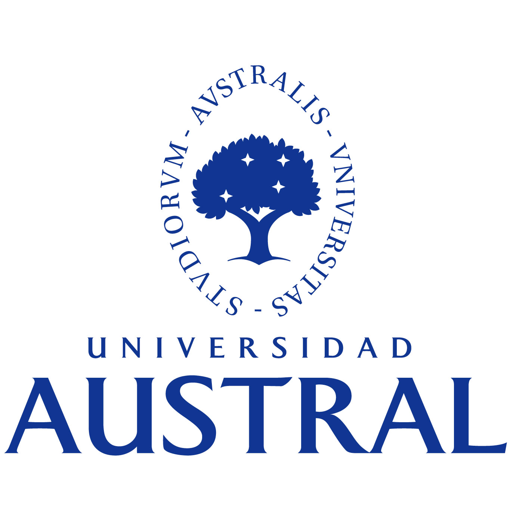

+++
title = 'Resume'
date = 2024-06-30T22:32:34-03:00

showDate = false
showDateOnlyInArticle = false
showDateUpdated = false
showHeadingAnchors = false
showPagination = false
showReadingTime = false
showTableOfContents = true
showTaxonomies = false 
showWordCount = false
showSummary = false
sharingLinks = false
showEdit = false
showViews = false
showLikes = false
layoutBackgroundHeaderSpace = false
+++

## Experience




Main game developer for the mobile game PetUs, developed in the Godot Engine.



As part of the Global PwC Identity team, I work on Access Management solutions for our internal global services, mainly focusing on Forgerock products and Azure Devops pipelines



Identity and Access Management developer for PwC internal services. Working as a full stack developer with Angular and Java



Web development in React and Mobile development in React Native. Together with my team, the job was to define requirements with the client, write User Stories, schedule a cronogram, and develop both the web and mobile platforms.



Frontend Web development in Angular.
Created and updated new pages for social insurance companies.
In charge of implementing Search Engine Optimization (SEO) for the webpage.




---

## Skills

- Design Thinking
- Web Development
- Mobile Development
- Project Management
- Game Design
- Game Development
- Agile / Scrum

### Technologies

- Java
- Javascript / Typescript
- Node.js
- Linux Bash
- Angular
- React.js
- React Native
- C# / Unity
- Docker
- Microsoft Azure DevOps
- HTML5
- CSS

---

## Education




I hold a Software Engineer degree from Universidad Austral, Buenos Aires, where I gained a strong foundation in Information Technology. The study plan spans five years of intensive studies including courses on OOP, software and architecture design and software development methodologies, amongst many others.



International Exchange Program at NUCB, Japan, as part of my Software Engineering Degree.

I was able to complete this program with the help of the JASSO scholarship awarded by the Japanese government to exchange students with outstanding grades.

Courses in NUCB included subjects from both MSc and MBA programs such as Design Thinking, Strategic Thinking, Digital Marketing, Service Design, etc.




---

## Honors and Awards

<table>
    <thead>
        <tr>
            <th>Date</th>
            <th></th>
            <th>Title</th>
            <th>Issued by</th>
            <th>Description</th>
        </tr>
    </thead>
    <tbody>
        <tr>
            <td>Feb 2023</td>
            <td></td>
            <td>Graduated with Honors Diploma</td>
            <td>Universidad Austral</td>
            <td>An honors diploma is awarded to students who graduate with a score of 7/10 or above</td>
        </tr>
        <tr>
            <td>Feb 2023</td>
            <td></td>
            <td>Silver Medal</td>
            <td>Universidad Austral</td>
            <td>Universidad Austral awards a silver medal to students who fulfill the following criteria: 
- Achieve a GPA of 3.2 or above 
- No failed final examinations</td>
        </tr>
    </tbody>
</table>

---

## Languages

<table>
    <thead>
        <tr>
            <th>Language</th>
            <th>Level</th>
        </tr>
    </thead>
    <tbody>
        <tr>
            <td>Spanish</td>
            <td>Native</td>
        </tr>
        <tr>
            <td>English</td>
            <td>Bilingual</td>
        </tr>
        <tr>
            <td>Japanese</td>
            <td>Intermediate</td>
        </tr>
        <tr>
            <td>Greek</td>
            <td>Intermediate</td>
        </tr>
        <tr>
            <td>French</td>
            <td>Beginner</td>
        </tr>
    </tbody>
</table>
